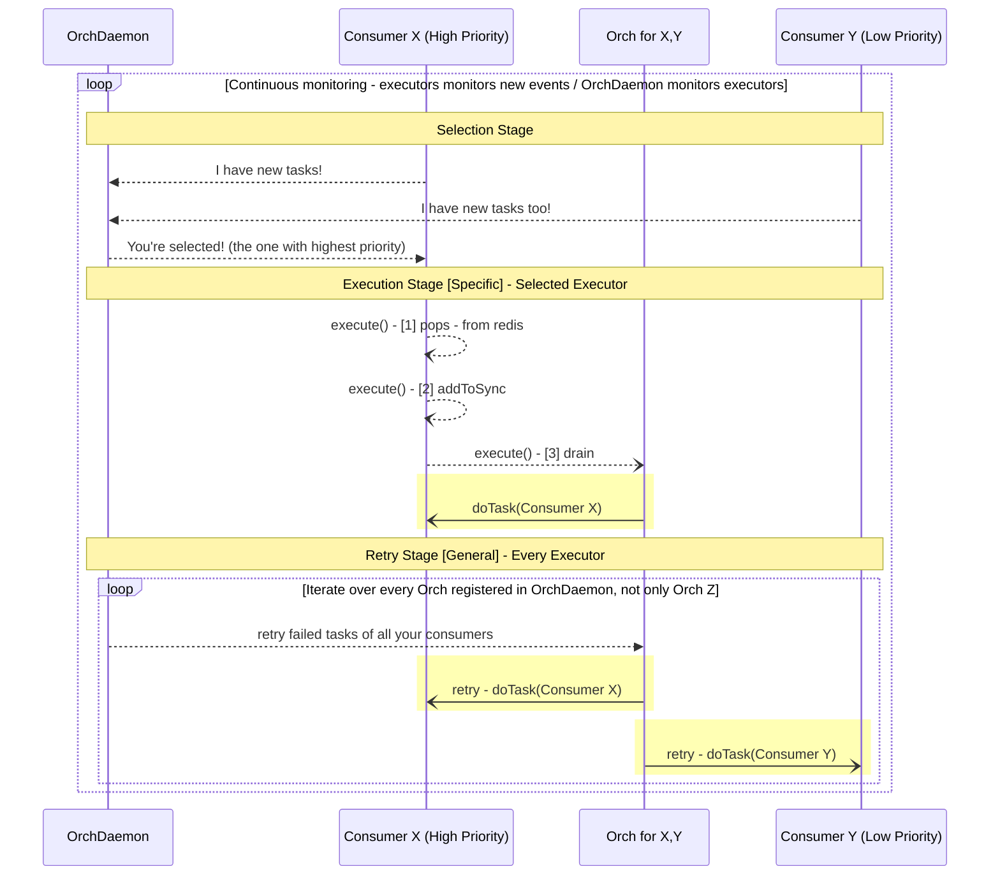
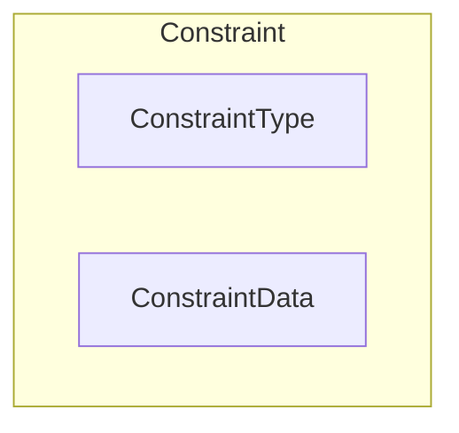
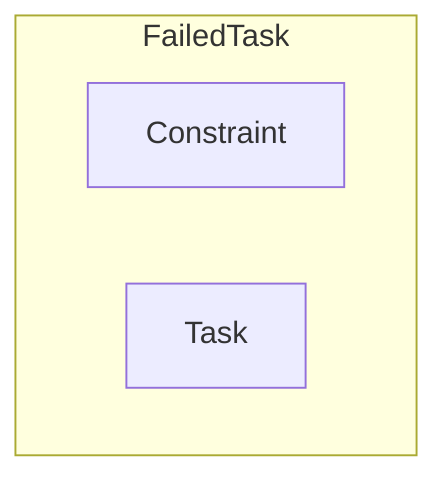
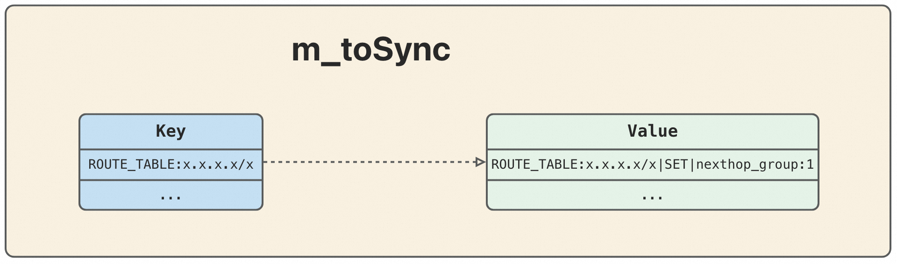
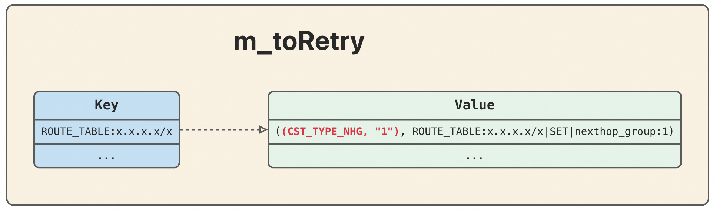
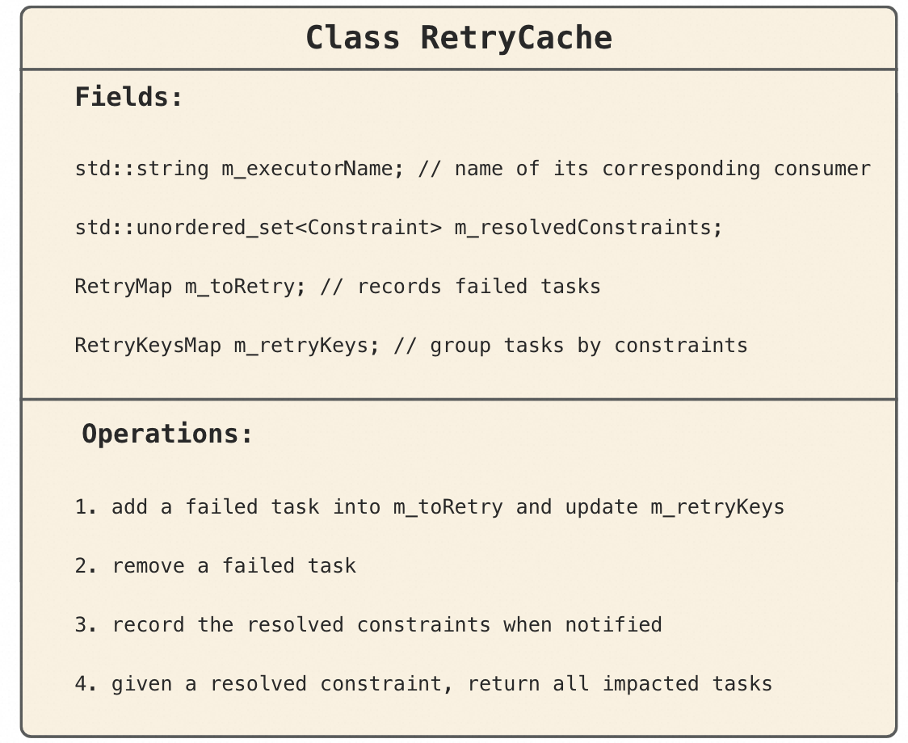
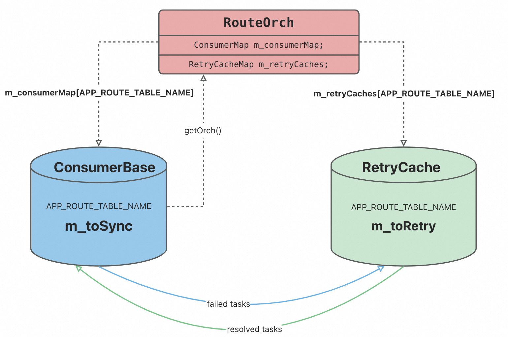
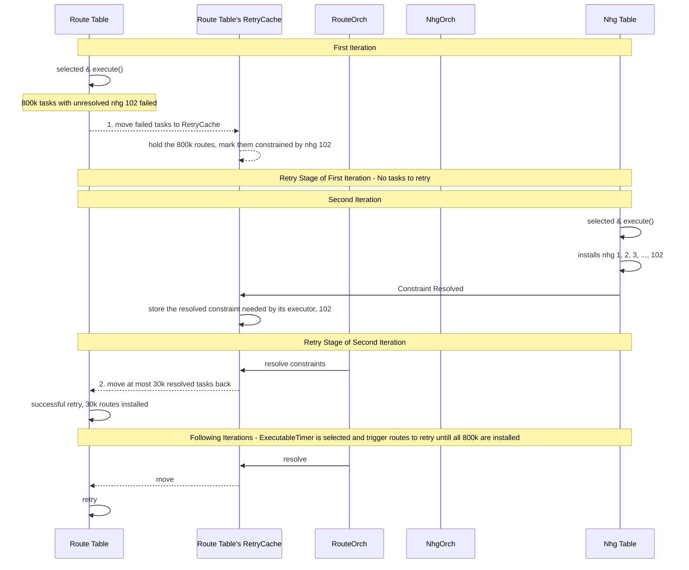

<!-- omit in toc -->
# OrchDaemon Retry Optimization

<!-- omit in toc -->
## Revision

| Rev |     Date    |       Author       | Change Description                |
|:---:|:-----------:|:------------------:|-----------------------------------|
| 1.0 | Oct 3 2024 |   Yijiao Qin       |  |

<!-- omit in toc -->
## Table of Contents

- [Overview](#overview)
- [Terminology](#terminology)
- [Context](#context)
  - [OrchDaemon Workflow](#orchdaemon-workflow)
  - [Selection Stage](#selection-stage)
  - [Execution Stage](#execution-stage)
  - [Retry Stage](#retry-stage)
- [Problem Statement](#problem-statement)
  - [Consequences of Prolonged Retry Stage](#consequences-of-prolonged-retry-stage)
  - [Example: Scaled Routes Insertion Failure](#example-scaled-routes-insertion-failure)
    - [First Iteration - Fail Twice](#first-iteration---fail-twice)
    - [Following Iterations - Fail Once Per Iteration](#following-iterations---fail-once-per-iteration)
    - [Last Iteration - Succeed](#last-iteration---succeed)
  - [Requirements](#requirements)
- [Constraint Identification](#constraint-identification)
  - [Demo Example](#demo-example)
  - [Constraint Definition](#constraint-definition)
- [Failure Handling](#failure-handling)
  - [FailedTask Definition](#failedtask-definition)
  - [RetryMap](#retrymap)
  - [Separate Failed Tasks](#separate-failed-tasks)
- [Dedicated Agent: RetryCache](#dedicated-agent-retrycache)
  - [On-demand Allocation](#on-demand-allocation)
- [Constraint Resolution](#constraint-resolution)
  - [Notification](#notification)
  - [Check RetryCache During OrchDaemon's Retry Stage](#check-retrycache-during-orchdaemons-retry-stage)
- [Workflow Illustration of Optimized OrchDaemon Event Loop](#workflow-illustration-of-optimized-orchdaemon-event-loop)
- [Logging](#logging)
- [Test](#test)
  - [Check whether the duration of retry decreases](#check-whether-the-duration-of-retry-decreases)
  - [Check the CPU business](#check-the-cpu-business)

## Overview

This doc is about SWSS OrchDaemon optimization on its retry process, with `RetryCache` feature.

By separately caching failed tasks for future retry, executors handle failures in a more efficient way.

From the coding perspective, we limit our scope to executors which are instances of `ConsumerBase`, which use `m_toSync` to store pending tasks, including both unprocessed ones and tasks that have failed already and needs retry.

## Terminology

|       Terms              |                  Description            |
| ------------------------ | --------------------------------------- |
| SWSS                     | Switch State Service                    |

## Context

### OrchDaemon Workflow

`OrchDaemon` repeats its event-based while-loop, once started.

The workflow per iteration consists of 3 stages as illustrated below:

1. Selection stage
   - select the most prioritized executor with unprocessed new tasks
2. Execution stage ***[specific]***
   - the selected executor executes all its pending tasks stored in `m_toSync`
3. Retry stage ***[general]***
   - all executors retry failed tasks

<br>



### Selection Stage

Executors are initialized with different priorities.

From the pool of candidates who have new tasks ready for execution, OrchDaemon selects the most prioritized at the moment, which means,
the length of the gap between selections could affect who is the next selected.

For example, if an executor is currently the highest prioritized, the longer it waits for the selection stage comes,
the higher chance that a higher-priority gets new tasks ready and participate in the selection.

It's worth noticing that there are some executable timers in the system, they are periodically ready and have very high priority.
If the gap until the next selection exceeds the timer's period, the timer would get selected.

If some factors lead to a constant long gap,
OrchDaemon would always select an `ExecutableTimer` instance, which leads to starvation of others, such as redis table consumers.

### Execution Stage

In the execution stage, the selected executor

- pops incoming new data from its subscribed redis table
- stores them as tasks in `m_toSync`
- processes tasks in `m_toSync` one by one
  - erases it, on success
  - continue to next, on failure

at the end, only failed tasks are left in `m_toSync`

### Retry Stage

In the retry stage

- all executors registered to `OrchDaemon` retry their pending tasks left in `m_toSync`
- including the selected executor in this run
- could last very long if too many tasks failed in the execution stage
- if it's very long, there come the consequences

## Problem Statement

### Consequences of Prolonged Retry Stage

- It delays the selection of next executor
  - who may resolve the constraints of current failures

- It could change who is selected, in the next run
  - an unrelated executor, but with high-pri, could get selected in the next run
  - which further delay the selection of the executor who can resolve the constraints

- Starvation
  - the previously failed tasks, with their constraints unresolved, get retried and fail again in the next retry stage
    - it's a deadlock, since failures are waiting for the correct executor to resolve their constraints, otherwise they make the selection gap very large, but that executor can never be selected if the gap is very large
  - which could lead to starvation

### Example: Scaled Routes Insertion Failure

Let's install some routes with next hop group indexed by 1, which doesn't exist.

P.S. this simulates the event order issue: route insertion before nhg is installed.

#### First Iteration - Fail Twice

`APP_ROUTE_TABLE` is selected for execution. Its route insertion tasks fail because the referred next hop group does not exist. They fail again in the retry stage, since the next hop group constraint are not resolved.

Since the executor attempts to install the routes twice, which both fail, this iteration could last very long.

#### Following Iterations - Fail Once Per Iteration

- If the first iteration lasts more than 1 second (assume we attempt to install 800k routes), an ExecutableTimer instance, who has new tasks every 1 second, would get ready during that time, and participate in the new selection. Since it has higher priority, it would win the selection, although `NEXTHOP_GROUP_TABLE` executor is also ready, it would not be selected.

  - ***[Deadlock]*** The consequence is, if `NEXTHOP_GROUP_TABLE` executor can't be selected, next hop group "1" can't be installed, and the route insertion tasks would always fail since the constraint is not resolved. And if the route tasks always fail, they would always get retried in the following iterations, make those iterations always time-consuming, during which an ExecutableTimer instance always gets ready. Then `NEXTHOP_GROUP_TABLE` executor never gets selected.
  - Only ExecutableTimer instances gets selected in the following iterations, and the system gets starved and stuck.

- If the first iteration lasts less than 1 second (assume we attempt to install 8 routes), ExecutableTimer is not ready yet, since `NEXTHOP_GROUP_TABLE` executor is ready, it would be selected in the next iteration.

#### Last Iteration - Succeed

If the routes are not scaled, `NEXTHOP_GROUP_TABLE` can be selected, and create the next hop group 1.

Route insertion tasks are retried in the retry stage, and succeed.

### Requirements

- the system should be robust when inserting scaled routes
  - control the duration of OrchDaemon retry stage
    - should not affect the normal execution process
  - skip retrying those tasks with constraints not yet resolved
    - save CPU cycles
  - limit the number of tasks to retry, even though task constraints have already been resolved
    - avoid starvation
- the new design should be able to
  - identify the constraint for a specific task
  - determine how to skip task with unresolved constraints
  - determine how to maintain the skipped tasks, so they can be restored
  - identify when the constraint gets resolved
  - make in-time notification of constraint resolution
  - make configurable the number of tasks to retry in OrchDaemon's retry stage
  - do readable logging, easy to debug

## Constraint Identification

### Demo Example

- let's dispatch a task to set the next hop group of `x.x.x.x/x` to be "1", but nhg 1 doesn't exist at the moment.

### Constraint Definition

When a task fails, it's important to understand why, and identify the constraint.

In this example, the task fails because the route refers to an invalid next hop group. The task would always fail no matter how often you retry it, unless this nhg constraint is resolved, when `nhgorch` successfully installs nhg 1.

Hence we define 3 customized c++ types:

- `enum ConstraintType`
  - for example, nhg missing is a type of constraint
- `ConstraintData`
  - for example, it specifies which nhg constraints the task to succeed
- `Constraint`
  - which is a pair consisting of `ConstraintType` and `ConstraintData`



In the demo example, we code the constraint into the below variable:

```c
Constraint demo_cst = std::make_pair(CST_TYPE_NHG, "1");
```

## Failure Handling

### FailedTask Definition

  Every task is `KeyOpFieldsValuesTuple` defined in `libswsscommon`, from the perspective of SWSS module.

- we can print the demo task (installing route x.x.x.x/x with nhg 1) as:

  ```c
  ROUTE_TABLE:x.x.x.x/x | SET | nexthop_group:1
  ```

- ***key***: `ROUTE_TABLE:x.x.x.x/x`
- ***op***: `SET`
- ***FV tuples***: `nexthop_group:1`

Now we define a new type ***`FailedTask`***, which combines the task with its constraint:

  ```c++
  using Task = swss::KeyOpFieldsValuesTuple;
  using FailedTask = std::pair<Constraint, Task>;

  Constraint cst = std::make_pair(CST_TYPE_NHG, "1");

  FailedTask ftask = std::make_pair(cst, task);
  ```



### RetryMap

SWSS orchagent `routeorch` has its dedicated consumer to process route tasks. Our demo task would be added into this consumer's local store, `m_toSync`. To achieve a quick query, `m_toSync` is designed to be a map, which indexes tasks by keys. Hence, the demo task is stored in `m_toSync` as below:
<p align="center">

</p>

However, `m_toSync` doesn't distinguish

- new tasks in this run
- failed tasks from the previous run

Now we add a new field `m_toRetry`, to dedicatedly store failed tasks, with its type as `RetryMap`.

<p align="center">

</p>

p.s. `m_toRetry` maps a task key to a `FailedTask`, while a `m_toSync` maps a key to a regular `Task`.

|          | Customized C++ Type   |  Map Key  |  Map Value         |
| :-------:|:-------: | :--- | :------------- |
| m_toSync | SyncMap |  KEY(`std::string`)  | Task (`swss::KeyOpFieldsValuesTuple`)     |
| m_toRetry| RetryMap|  KEY(`std::string`)  | FailedTask(`std::pair<Constraint, Task>`)|

### Separate Failed Tasks

When a consumer loops over tasks in `m_toSync` to executes them one by one, it either successfully processes and erases it, or finds something wrong and thus leaving it in `m_toSync` as it is, then continue to the next.

***New Behavior of Failure Handling:***

- move the task from `m_toSync` to `m_toRetry`
- and move it back only if its constraint is resolved and ready to retry

By doing so, when the consumer later gets selected by orchdaemon, its `m_toSync` are free of previous legacies whose constraints are unresolved and should not be retried.

There would be some reformatting work since the two maps are of different types.

The task would be stored in `m_toRetry` as the entry below:

|   Key  |  Value         |
| :---: | :-------------: |
|`ROUTE_TABLE:x.x.x.x/x`| a pair of constraint (representing nexthop group 1) and the demo task|

So that we can

- access the task quicky as we do in `m_toSync`
- and get the constraint together with the task itself

## Dedicated Agent: RetryCache

We define the new class `RetryCache` in retrycache.h

- which serves as an agent for a consumer to
  - store failed tasks and constraints
- `m_toRetry` implements the quick task look-up
  - O(1), given the task key
- `m_retryKeys` implements quick constraint resolution
  - O(1) look-up for the set of related tasks, given a constraint
- implements quick deletion in both maps, given a task
  - O(1) look-up in `m_toRetry` using task key
    - find the constraint stored in `FailedTask` entry in `m_toRetry`
  - O(1) look-up in `m_retryKeys` using the retrieved constraint
- `m_resolvedConstraints` decouples resolution notification and actual retry process
  - when notified of the resolution, add the constraint into the set
  - when OrchDaemon enters retry stage, loop over the set and retry resolved tasks

<p align="center">

</p>

### On-demand Allocation

Orchagent could allocate a retry cache for a consumer on demand, during the initialization process, and maintain them by `m_retryCaches`, similar to `m_consumerMap`.

For orchagent, similar to access `ConsumerBase` with executor name by quering `m_consumerMap`, now it could also access a retry cache by the executor name with `m_retryCaches`.

If a task fails, orchagent identifies the constraint and moves the task from its consumer's `m_toSync` to the corresponding retry cache's `m_toRetry`, the two maps are indeed linked together by the executor name.

<p align="center">

</p>

Since every consumer could access its orchagent, now it could access its retry cache via its orchagent.

Now for a consumer, its pending tasks are distributed in two different maps:

- new or resolved tasks in `m_toSync`
- failed tasks with unresolved constraints in `m_toRetry`

## Constraint Resolution

### Notification

The resolution happens during the execution stage.

For example, when `nhgorch` successfully installs nhg 1, it resolves the constraint for `routeorch`'s tasks depending on nhg 1. `nhgorch` should notify `routeorch` of this resolution.

`nhgorch` has no idea about which nhg is needed by others, so it notifies on every successful nhg installment.

`routeorch` receives the notifications, and gets the route table executor's retrycache to check whether there are tasks affected by this constraint. If no, it ignores this notification. Otherwise, it adds this constraint into the route table executor's `m_resolvedConstraints`.

The route table executor only marks the constraint as resolved but doesn't retry tasks right now, since it's still in nhg executor's execution stage.

### Check RetryCache During OrchDaemon's Retry Stage

In the original design, OrchDaemon drains all tables in the retry stage.

***New:*** OrchDaemon checks the executors' retrycaches, move resolved tasks back to m_toSync, then drains.

To avoid blocking, we set a threshold [30k] for number of tasks moved back to `m_toSync`.

- Below attached the logs of installing 800k routes referring to nhg 102 with nhg 102 missing.
- These routes get retried after nhgorch installs nhg 102.
- `routeorch` retries 30k routes in the retry stage of each iteration.
- Only the ExecutableTimer instance gets selected every 1 second, hence the retry stage happens about once per second, we coud thus see routes are retried every 1 second.

```c++
2024-09-30.23:56:27.579214| (RETRY_CST_NHG, 102) resolution notified -> 800000 tasks
2024-09-30.23:56:27.600488| (RETRY_CST_NHG, 102) | ROUTE_TABLE | 30000 retried
2024-09-30.23:56:29.189674| (RETRY_CST_NHG, 102) | ROUTE_TABLE | 30000 retried
2024-09-30.23:56:30.184353| (RETRY_CST_NHG, 102) | ROUTE_TABLE | 30000 retried
2024-09-30.23:56:31.177945| (RETRY_CST_NHG, 102) | ROUTE_TABLE | 30000 retried
2024-09-30.23:56:32.034060| (RETRY_CST_NHG, 102) | ROUTE_TABLE | 30000 retried
2024-09-30.23:56:32.914382| (RETRY_CST_NHG, 102) | ROUTE_TABLE | 30000 retried
2024-09-30.23:56:34.055416| (RETRY_CST_NHG, 102) | ROUTE_TABLE | 30000 retried
2024-09-30.23:56:34.949810| (RETRY_CST_NHG, 102) | ROUTE_TABLE | 30000 retried
2024-09-30.23:56:35.857533| (RETRY_CST_NHG, 102) | ROUTE_TABLE | 30000 retried
2024-09-30.23:56:36.822628| (RETRY_CST_NHG, 102) | ROUTE_TABLE | 30000 retried
2024-09-30.23:56:37.745675| (RETRY_CST_NHG, 102) | ROUTE_TABLE | 30000 retried
2024-09-30.23:56:38.720946| (RETRY_CST_NHG, 102) | ROUTE_TABLE | 30000 retried
2024-09-30.23:56:39.855677| (RETRY_CST_NHG, 102) | ROUTE_TABLE | 30000 retried
2024-09-30.23:56:40.803662| (RETRY_CST_NHG, 102) | ROUTE_TABLE | 30000 retried
2024-09-30.23:56:42.035631| (RETRY_CST_NHG, 102) | ROUTE_TABLE | 30000 retried
2024-09-30.23:56:43.004442| (RETRY_CST_NHG, 102) | ROUTE_TABLE | 30000 retried
2024-09-30.23:56:43.968165| (RETRY_CST_NHG, 102) | ROUTE_TABLE | 30000 retried
2024-09-30.23:56:44.928843| (RETRY_CST_NHG, 102) | ROUTE_TABLE | 30000 retried
2024-09-30.23:56:45.886013| (RETRY_CST_NHG, 102) | ROUTE_TABLE | 30000 retried
2024-09-30.23:56:47.374204| (RETRY_CST_NHG, 102) | ROUTE_TABLE | 30000 retried
2024-09-30.23:56:48.440001| (RETRY_CST_NHG, 102) | ROUTE_TABLE | 30000 retried
2024-09-30.23:56:49.626867| (RETRY_CST_NHG, 102) | ROUTE_TABLE | 30000 retried
2024-09-30.23:56:50.644571| (RETRY_CST_NHG, 102) | ROUTE_TABLE | 30000 retried
2024-09-30.23:56:51.682208| (RETRY_CST_NHG, 102) | ROUTE_TABLE | 30000 retried
2024-09-30.23:56:52.697740| (RETRY_CST_NHG, 102) | ROUTE_TABLE | 30000 retried
2024-09-30.23:56:53.779511| (RETRY_CST_NHG, 102) | ROUTE_TABLE | 30000 retried
2024-09-30.23:56:54.852819| (RETRY_CST_NHG, 102) | ROUTE_TABLE | 20000 retried
```

## Workflow Illustration of Optimized OrchDaemon Event Loop



## Logging

We record tasks when they are moved between `m_toSync` and `m_toRetry`.

- `++++` means the tuple is moved into retry cache, i.e. from `m_toSync` to `m_toRetry`
- `----` means the tuple is moved out of retry cache, i.e. from  `m_toRetry` to `m_toSync`

Compared with `swss.rec`, each record in `retry.rec` have a timestamp and direction field before the tuple field.

```bash
root@MC-54:/var/log/swss# cat retry.rec | grep 5.5.78.31/32   

2024-09-11.18:55:38.383953| ++++ |ROUTE_TABLE:5.5.78.31/32|SET|nexthop_group:1                                                         
2024-09-11.18:56:22.144220| ---- |ROUTE_TABLE:5.5.78.31/32|SET|nexthop_group:1
```

## Test

### Check whether the duration of retry decreases

1. Insert 40k routes referring to a non-existent nhg, which would keep retrying but never succeed

2. Delete a non-existent next hop group, which makes `NEXTHOP_GROUP_TABLE` to be selected and triggers all executors retrying

3. Measure the duration of retry stage in `OrchDaemon`'s event loop.

4. Measure the duration of retrying `ROUTE_TABLE` and the size of `m_toSync` before and after retry

Before optimization.

```c++
NEXTHOP_GROUP_TABLE's run: retry stage takes 484 milliseconds!
```

```c++
ROUTE_TABLE retry : 40000 entries -> 40000 entries in m_toSync, takes 468 milliseconds 
```

After optimization:

```c++
NEXTHOP_GROUP_TABLE's run: retry stage takes 6 milliseconds!
```

```c++
ROUTE_TABLE retry : 0 entries -> 0 entries in m_toSync, takes 0 milliseconds 
```

### Check the CPU business

After optimization, the %CPU of orchagent would decrease during retry stage.
