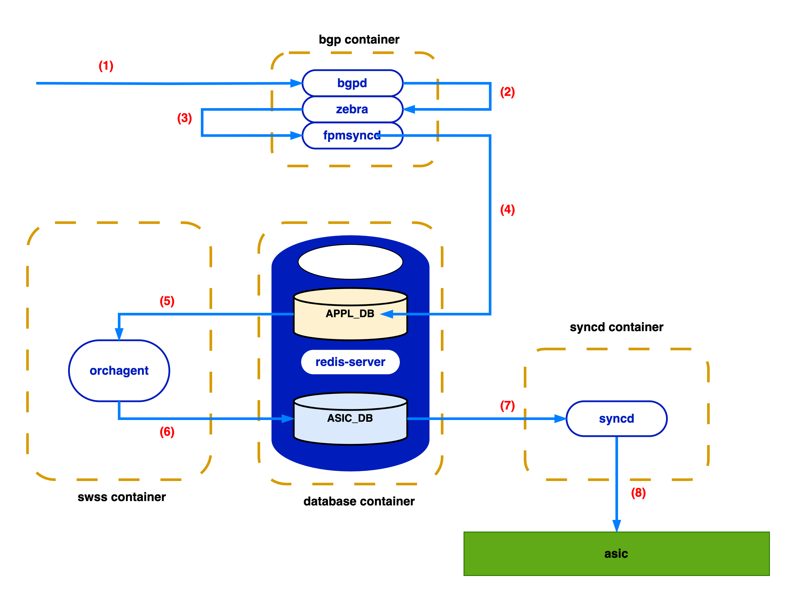

<!-- omit in toc -->
# SONiC BGP Loading Time Enhancement

<!-- omit in toc -->
### Revision
| Rev |     Date    |       Author       | Change Description                |
|:---:|:-----------:|:------------------:|-----------------------------------|
| 0.1 | Aug 16 2023 |   Yang FengSheng   | Initial Draft                     |
| 0.2 | Aug 25 2023 |   Yijiao Qin       | Second Draft                      |

<!-- omit in toc -->
## Table of Content
- [Goal \& Scope](#goal--scope)
- [Definitions \& Abbreviations](#definitions--abbreviations)
- [Bottleneck Analysis](#bottleneck-analysis)
  - [Problem overview](#problem-overview)
  - [Serial orchagent](#serial-orchagent)
  - [Serial syncd](#serial-syncd)
  - [Unnecessary APPL\_DB I/O traffic](#unnecessary-appl_db-io-traffic)
    - [fpmsyncd flushes on every data arrival](#fpmsyncd-flushes-on-every-data-arrival)
    - [APPL\_DB does redundant housekeeping](#appl_db-does-redundant-housekeeping)
  - [Slow Routes decode and kernel thread overhead in zebra](#slow-routes-decode-and-kernel-thread-overhead-in-zebra)
- [Requirements](#requirements)
- [High-Level Proposal](#high-level-proposal)
  - [Modification in orchagent/syncd to enable multi-threading](#modification-in-orchagentsyncd-to-enable-multi-threading)
    - [Ring buffer for low-cost thread coordination](#ring-buffer-for-low-cost-thread-coordination)
  - [Streamlining Redis I/O](#streamlining-redis-io)
    - [Lower frequency of the fpmsyncd flush \& APPL\_DB publish](#lower-frequency-of-the-fpmsyncd-flush--appl_db-publish)
    - [Disable the temporary table mechanism in APPL\_DB](#disable-the-temporary-table-mechanism-in-appl_db)
- [Low-Level Implementation](#low-level-implementation)
  - [Multi-threaded orchagent with a ring buffer](#multi-threaded-orchagent-with-a-ring-buffer)
  - [Syncd \[similar optimization to orchagent\]](#syncd-similar-optimization-to-orchagent)
  - [Fpmsyncd](#fpmsyncd)
  - [APPL\_DB](#appl_db)
  - [Zebra](#zebra)
- [WarmRestart scenario](#warmrestart-scenario)
- [Testing Requirements/Design](#testing-requirementsdesign)
  - [System test](#system-test)
  - [Performance measurements when loading 500k routes](#performance-measurements-when-loading-500k-routes)

## Goal & Scope
The goal of this project is to significantly increase the end-to-end BGP routes loading speed in SONiC.
  - from 10k routes per sec to 25K routes per sec
  
<figure align=center>
    
    <figcaption>Performance after optimization on Alibaba's platform when loading 500k BGP routes<figcaption>
</figure>  


The scope of this document only covers the performance optimization in `fpmsyncd`, `orchagent`, `syncd` and `zebra` and Redis I/O.

We also observed performance bottleneck in `libsai`, but SAI/ASIC optimaztion is out of our scope since it varies by hardware.

## Definitions & Abbreviations

| Definitions/Abbreviation | Description                             |
| ------------------------ | --------------------------------------- |
| ASIC                     | Application specific integrated circuit |
| BGP                      | Border Gateway Protocol                 |
| SWSS                     | Switch state service                    |
| SYNCD                    | ASIC synchronization service            |
| FPM                      | Forwarding Plane Manager                |
| SAI                      | Switch Abstraction Interface            |
| HW                       | Hardware                                |
| SW                       | Software                                |


## Bottleneck Analysis

### Problem overview
With the rapid growth of network demands, the number of BGP routes rockets up these years and the BGP loading time of SONiC inevitably increases. To make sure that SONiC could reliably offer fast service regardless of the explosive BGP routes growth, the current BGP loading time, which is estimated at tens of seconds, is definitely far from satisfatory. Speeding up the BGP loading process is essential for the scalability of SONiC, then we need to break down the whole loading process into several steps as shown in the figure below and find the performance bottleneck in BGP loading:


1. `bgpd` parses the packets received by the socket, then processes the `bgp-update` message and notifies `zebra` of new prefixes and their corresponding next hops
2. `zebra` decodes the message from `bgpd`, and delivers this routing message via `netlink` to `fpmsyncd` 
3. `fpmsyncd` processes this routing message and pushes it to `APPL_DB`
4. `orchagent` has a subscription to `APPL_DB`, hence would consume the routing message newly pushed to `APPL_DB` 
5. `orchagent` then injects its processed routing message into `ASIC_DB` with `sairedis` APIs 
6. `syncd` gets notified of the newly added routing message in `ASIC_DB` due to the subscription
7. `syncd` processes the new routing message, then invokes `SAI` APIs to finally inject the new routing message into the hardware

**NOTE**: This is not the [whole workflow for routing](https://github.com/SONiC-net/SONiC/wiki/Architecture#routing-state-interactions), we ignore the Linux kernel part since we currently focus only on the SONiC part.

<figure align="center">
    
    <figcaption>Figure 1. SONiC BGP loading workflow</figcaption>
</figure>


We have measured the end-to-end BGP loading performance on Alibaba platform. 
<!-- <style>
table{
  margin:auto;
}
</style> -->
| Module                   |  Speed(kilo-routes per second) |
| ------------------------ | -------------------------------|
| Zebra                    |  <center>17k/s                 |
| Fpmsyncd                 |  <center>17k/s                 |
| Orchagent                |  <center>10.5k/s               |
| Syncd                    |  <center>10.5k/s               |
| Total                    |  <center>10.5k/s               |

The current bottleneck is 10.5k/s in `orchagent` and `syncd`  as shown in the table. 

### Serial orchagent

Figure 2 explains how `orchagent` transfers routing data from `APPL_DB` to `ASIC_DB`.

`RouteOrch`, as a component of `orchagent`, has its `ConsumerStateTable` subscribed to `ROUTE_TABLE_CHANNEL` event. With this subscription, whenever `fpmsyncd` injects new routing data into `APPL_DB`, `orchagent` gets notified. Once notified, `orchagent` do 3 tasks in serial.

1. use `pops` to fetch new routes from `APPL_DB`:
     - pop prefix from ROUTE_TABLE_SET 
     - traverse these prefixes and retrieve the temporary key data of _ROUTE_TABLE corresponding to the prefix
     - set key in ROUTE_TABLE 
     - delete temporary key in _ROUTE_TABLE
2. call `addToSync` to record the new routes to a local file `swss.rec`
3. call `doTask` to parse new routes one by one and store the processed data in the EntityBulker, and flush the data in EntityBulker to ASIC_DB as a whole


The main performance bottleneck here lies in the linearity of the 3 tasks.

<br>

<figure align=center>
    
    <figcaption>Figure 2. Orchagent workflow<figcaption>
</figure>  


### Serial syncd

`syncd` shares the similar problem (job linearity) with `orchagent`, the only difference is that `syncd` moves information from `ASIC_DB` to the hardware. 

<br>

<figure align=center>
    
    <figcaption>Figure 3. Syncd workflow<figcaption>
</figure>  

### Unnecessary APPL_DB I/O traffic

There is much Redis I/O traffic during the BGP loading process, from which we find two sources of unnecessary traffic.

#### fpmsyncd flushes on every data arrival
In the original design, `fpmsyncd` maintains a variable `pipeline`. Each time `fpmsyncd` receives routes from zebra, it put the processed routes in the `pipeline`, and flushes the pipeline to `APPL_DB` to make sure no data get stuck in the pipeline, and then publishs the updates, which triggers the subscribers to do Redis read operations. `fpmsyncd` also flushes the pipeline when it gets full.

That means, the flush frequency is decided by the data arrival frequency and the `pipeline` size, which is unnecessarily high and hurts performance.

#### APPL_DB does redundant housekeeping
When `orchagent` consumes `APPL_DB` with `pops()`, as Figure 2 shows, `pops` function not only reads from `route_table_set` to retrieve route prefixes, but also utilizes these prefixes to delete the entries in the temporary table `_ROUTE_TABLE` and write into the stable table `ROUTE_TABLE`, while at the same time transferring messages to `addToSync` procedure. The transformation from temporary tables to the stable tables causes much traffic but is actually not worth the time. 

### Slow Routes decode and kernel thread overhead in zebra

`zebra` receives routes from `bgpd`. To understand the routing data sent by `bgpd`, it has to decode the received data with `zapi_route_decode` function, which consumes most computing resources, as the flame graph indicates. This function causes the slow start for `zebra`, since decode only happens at the very beginning of receiving new routes from `bgpd`.


Although `zebra` employs two separate threads to send routes to both `Linux kernel` and `fpmsyncd`, both threads would return states that indicate whether the routing data are transfered successfully, then the main thread of `zebra` needs to talk with both threads. Hence when `zebra` is busy handling the installing states to kernel, the performance of that thread sending routes to `fpmsyncd` would be affected.

<br>

<figure align=center>
    
    <figcaption>Figure 4. Zebra flame graph<figcaption>
</figure>  

## Requirements

- All modifications should maintain the time sequence of route loading
- All modules should support the warm restart operations after modified
- With the optimization of this HLD implemented, the end-to-end BGP loading performance should be improved at least by 95%


## High-Level Proposal

### Modification in orchagent/syncd to enable multi-threading
Figure 5 below illustrates the high level architecture modification for `orchagent` and `syncd`, it compares the original architecture and the new pipeline architecture proposed by this HLD. The pipeline design changes the workflow of both `orchagent` and `syncd`, thus enabling them to employ multiple threads to do sub-tasks concurrently.

Take `orchagent` for example, a single task of `orchagent` contains three sub-tasks `pops`, `addToSync` and `doTask`, and originally `orchagent` performs the three sub-tasks in serial. A new `pops` sub-task can only begin after the previous `doTask` is finished, however that is not necessary, so the new design utilizes a separate thread to run `pops`, which decouples the `pops` sub-task from `addToSync` and `doTask`. As the figure shows, in the new pipeline architecture, a new `pops` sub-task begins immediately when it's ready, not having to wait for the previous `addToSync` and `doTask` to finish.

<figure align=center>
    
    <figcaption>Figure 5. Pipeline architecture compared with the original serial architecture<figcaption>
</figure>  

#### Ring buffer for low-cost thread coordination

`CODE of DATA STRUCTURE TO BE INSERTED`

The producer thread and the consumer thread share the ring buffer.
This ring buffer data structure not only temporarily stores data, but also serves the role of `mutex` while beats it in performance since the ring buffer is spared from the overhead from context switching.
### Streamlining Redis I/O

The optimization for `orchagent` and `syncd` can theoretically double the BGP loading performance, which makes Redis I/O performance now the bottleneck.

#### Lower frequency of the fpmsyncd flush & APPL_DB publish

Instead of flushing the `pipeline` on every data arrival and propose to use a flush timer to determine the flush frequency as illustrated below.

<figure align=center>
    
    <figcaption>Figure 6. Proposed new BGP loading workflow<figcaption>
</figure>  

#### Disable the temporary table mechanism in APPL_DB

We propose to disable the temporary/stable table behavior and keep just a single table, so that we don't need to delete the temporary and then write into a stable one, which spares much `HDEL` and `HSET` traffic.

## Low-Level Implementation

### Multi-threaded orchagent with a ring buffer

Orchagent now runs two threads in parallel instead of a single thread.

- `table->pops(entries)` executes in the master thread to maintain the time sequence
- `Consumer->drain()` runs in a slave thread
- `Consumer->addToSync(entries)` is run by slave, as master is assumed to be busier
- `RingBuffer` is used for communication between the master thread and the slave
  - the master thread pops  `entries` to the ring buffer
  - the slave thread fetches `entries` from the ring buffer
  
Since SAI doesn't work well on small piece of data, the slave thread should check data size in ring buffer before it calls `Consumer->addToSync(entries)` to fetch data from the ring buffer, hence ensuring that it gets large enough data.

Routes will still be cached in `Consumer->m_toSync` rather than ring buffer if routeorch fails to push route to ASIC_DB. 

We use a new C++ class `Consumer_pipeline`, which is derived from the original `Consumer` class in `RouteOrch`, which enables the usage of a slave thread.

```c++
class Consumer_pipeline : public Consumer {
  public:
    /**
     * Table->pops() should be in execute(). 
     * Called by master thread to maintain time sequence.
     */
    void execute() override;  
    /**
     * Main function for the new thread.
     */
    void drain() override;    
    /**
     * Need modified to support warm restart
     */
    void dumpPendingTasks(std::vector<std::string> &ts) override;
    size_t refillToSync(swss::Table* table) override;
    /**
     * Dump task to ringbuffer and load task from ring buffer
     */
    void dumptask(std::deque<swss::KeyOpFieldsValuesTuple> &entries);
    void loadtask(std::deque<swss::KeyOpFieldsValuesTuple> &entries);
  private:
    /**
     * Use ring buffer to deliver/buffer data
     */
    RingBuffer<swss::KeyOpFieldsValuesTuple> task_RingBuffer;
    /**
     * New thread for drain
     */
    std::thread m_thread_drain;
}
```

### Syncd [similar optimization to orchagent]
Similar case for syncd with orchagent. In our proposal, syncd runs `processBulkEntry` in a slave thread, since this function consumes most of the computing resources and blocks others.

### Fpmsyncd

As mentioned, <b>a timer thread</b> is added to control the flush behavior of `fpmsyncd` to `APPL_DB`, mutex is required since both the timer thread and the master thread access `fpmsyncd`'s  `pipeline`.

We define a variable `FLUSH_INTERVAL` to represent the flush frequency, although we expect a lower frequency, it should make sure that data in the pipeline don't wait for too long to enter `APPL_DB`.

Since `fpmsyncd` also flushes the pipeline when it's full, `REDIS_PIPELINE_SIZE` also needs tuning. `10000` to `15000` is tested to be a good range in our use cases. 

### APPL_DB
<!-- omit in toc -->
#### sonic-swss-common/common/producerstatetable.cpp
The string variable `luaSet` contains the Lua script for Redis `SET` operation:
```c++
string luaSet =
  "local added = redis.call('SADD', KEYS[2], ARGV[2])\n"
  "for i = 0, #KEYS - 3 do\n"
  "    redis.call('HSET', KEYS[3 + i], ARGV[3 + i * 2], ARGV[4 + i * 2])\n"
  "end\n"
  " if added > 0 then \n"
  "    redis.call('PUBLISH', KEYS[1], ARGV[1])\n"
  "end\n";
```
In our design, the script changes to:
```lua
local added = redis.call('SADD', KEYS[2], ARGV[2])
for i = 0, #KEYS - 3 do
    redis.call('HSET', KEYS[3 + i], ARGV[3 + i * 2], ARGV[4 + i * 2])
end
```
Same modification should be add to `luaDel` for Redis `DEL` operation.

**NOTE:** The original lua script works fine for other modules, we only modify in the fpmsyncd case. 

By this modification, Redis operation `SET/DEL` is decoupled from `PUBLISH`.  

In this proposal, `PUBLISH` is binded with `fpmsyncd`'s flush behavior in `RedisPipeline->flush()` function, so that each time `fpmsyncd` flushes data to `APPL_DB`, the subscribers get notified.


<!-- omit in toc -->
#### sonic-swss-common/common/consumer_state_table_pops.lua
We removed the `DEL` and `HSET` operations in the original script, which optimizes `Table->pops()`:
```lua
redis.replicate_commands()
local ret = {}
local tablename = KEYS[2]
local stateprefix = ARGV[2]
local keys = redis.call('SPOP', KEYS[1], ARGV[1])
local n = table.getn(keys)
for i = 1, n do
   local key = keys[i]
   local fieldvalues = redis.call('HGETALL', stateprefix..tablename..key)
   table.insert(ret, {key, fieldvalues})
end
return ret
```
This change doubles the performance of `Table->pops()` and hence leads to routing from `fpmsyncd` to `orchagent` via APPL_DB 10% faster than before.

**NOTE:** This script change limits to `routeorch` module.

### Zebra
TBD

## WarmRestart scenario
This proposal also consider the compatibility with SONiC `WarmRestart` feature. For example, when a user updates the config, a warm restart may be needed for the config update to be reflected. Then SONiC's main thread would call `dumpPendingTasks()` function to save the current system states and restore the states after the warm restart. Since this HLD introduces a new thread and a new structure `ring buffer` which stores some data, then we have to ensure that the data in `ring buffer` all gets processed before warm restart. Also, during warm start, the main thread would modify the variable `m_toSync`, which the new thread also have access to, so we should block the new thread during warm restart to avoid conflict.

Take orchagent for example, we need to make sure ring buffer is empty and the new thread is in idle before we call ```dumpPendingTasks()```. 

## Testing Requirements/Design
### System test
- All modules should maintain the time sequence of route loading.
- All modules should support WarmRestart.
- No routes should remain in redis pipeline longer than configured interval.
- No data should remain in ring buffer when system finishes routing loading.
- System should be able to install/remove/set routes (faster than before).

### Performance measurements when loading 500k routes

- traffic speed via  `zebra` from `bgpd` to `fpmsyncd`
- traffic speed via `fpmsyncd` from `zebra` to `APPL_DB`
- traffic speed via `orchagent` from `APPL_DB` to `ASIC_DB`
- traffic speed via `syncd` from `ASIC_DB` to the hardware

